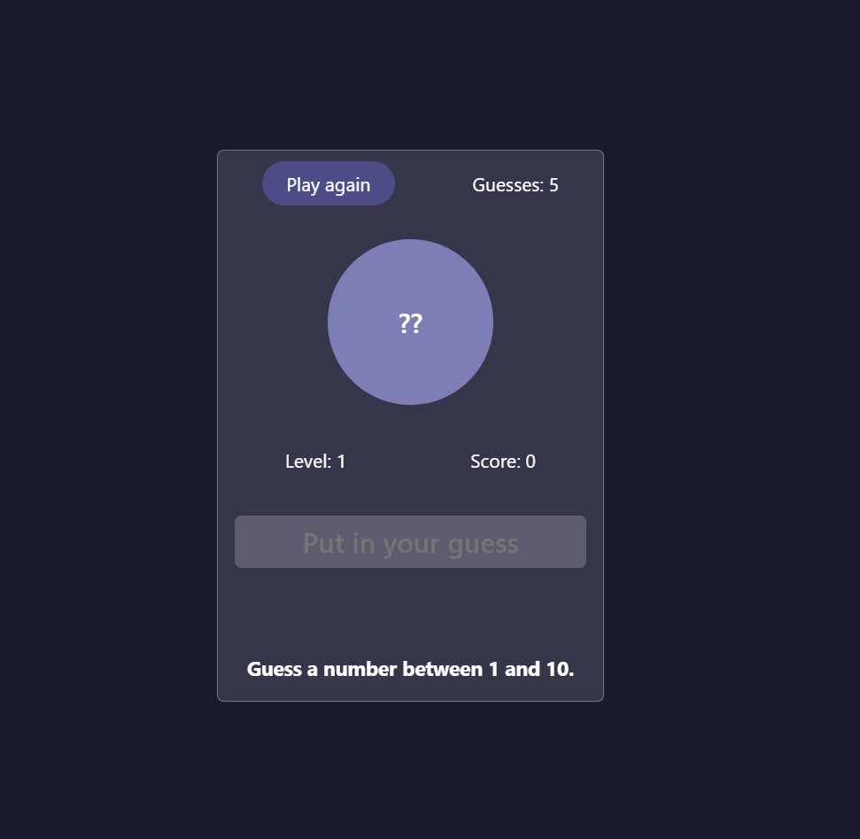
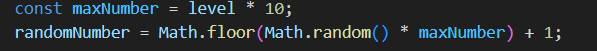

# Guessing Game

A fun number guessing game for IT students to practice their JavaScript skills.

## Features
- Random number generation based on the current level.
- Input validation for guesses.
- Dynamic feedback and score tracking.
- Progressive difficulty with increasing levels.
- Reset option to play again.

## How to Play
1. Clone this repository.
   ```bash
   git clone https://github.com/<your-username>/<repository-name>.git
   cd <repository-name>
   ```
2. Open `index.html` in a web browser.

3. Follow these steps to play:
- You will start at Level 1, and a random number will be generated between 1 and 10.
- Enter your guess in the input field and press Enter.
- If your guess is correct, you advance to the next level. Each new level increases the range of possible numbers by 10.
- Each level starts with 5 guesses. Every incorrect guess reduces the guess count.
- The game ends if you run out of guesses. You can restart by clicking the Play again button.
- The goal is to reach the highest level and score as much as possible.
- Keep track of your level, score, and remaining guesses displayed on the screen.

## Rules
- Input must be a valid number within the specified range.
- If the guess is too low or too high, you will receive feedback to adjust your next attempt.
- Successfully guessing the number increases your score and level.
- Losing all guesses ends the game, revealing the correct number.
- The game has 5 levels; progressing past level 5 is a significant achievement!

## Preview


## Demo
[Play it here](https://<your-username>.github.io/<repository-name>/)

## Development
### Code Snippet
Example of generating random numbers:
```javascript

